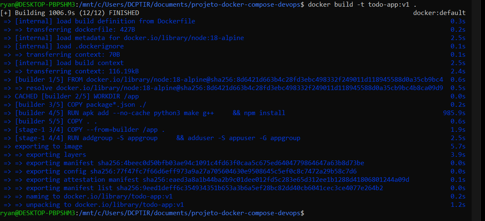
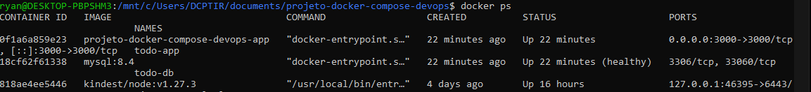
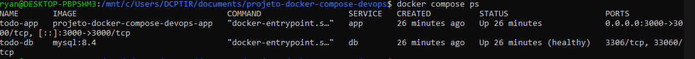
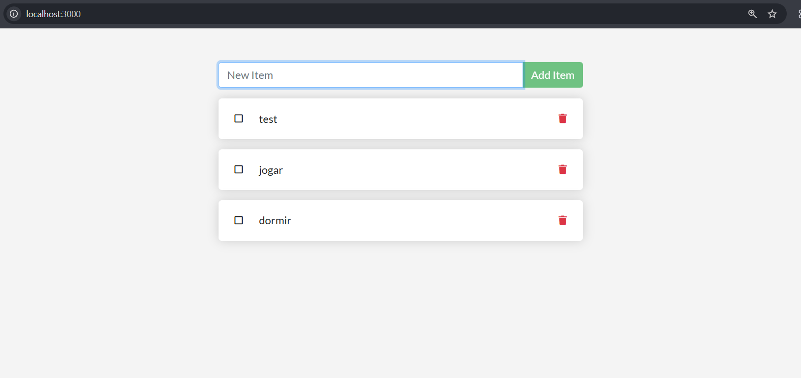
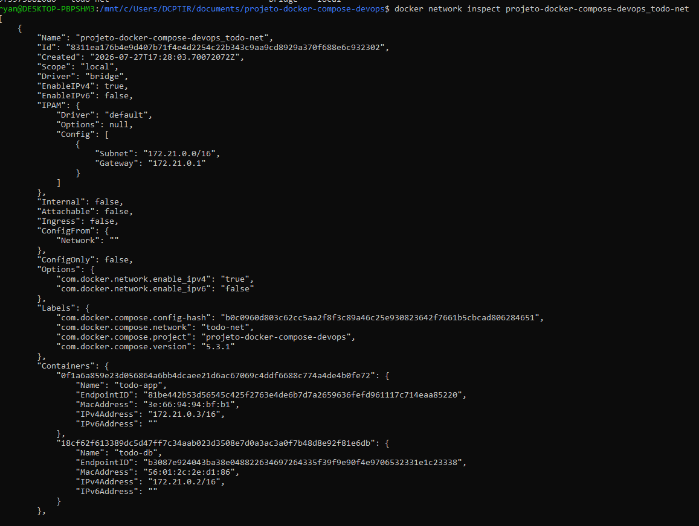
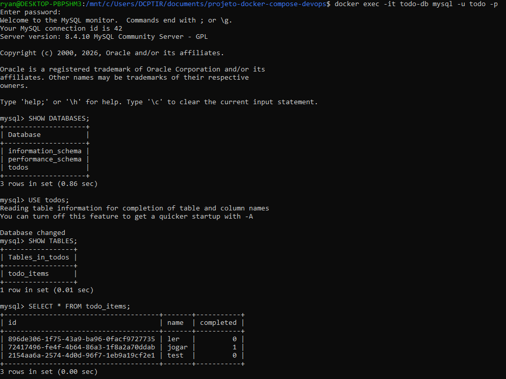

# Projeto Docker Compose - DevOps

## Aluno

- **Nome:** Ryan Kaio Sena da Silva
- **Disciplina:** DevOps

---

# 1. Objetivo

Containerizar a aplicação Todo App utilizando Docker, Docker Compose e MySQL, implementando persistência de dados, rede personalizada e integração contínua com GitHub Actions.

---

# 2. Construção da imagem Docker

Imagem criada com sucesso utilizando Dockerfile multi-stage.

### Comando utilizado

```bash
docker build -t todo-app:v1 .
```

### Print 1 - Build da imagem



---

### Print 2 - Lista de imagens

Comando:

```bash
docker ps
```



---

# 3. Docker Compose

Subida da aplicação utilizando Docker Compose.

Comando:

```bash
docker compose up -d
```

### Print 3 - Containers em execução

```bash
docker compose ps
```



---

### Print 4 - Aplicação funcionando

Acessando:

http://localhost:3000



---

# 4. Rede Docker

Rede criada automaticamente pelo Docker Compose.

Comando:

```bash
docker network inspect projeto-docker-compose-devops_todo-net
```

### Print 5 - Rede Docker



---

# 5. Banco de Dados MySQL

Acesso ao banco de dados:

```bash
docker exec -it todo-db mysql -u todo -p
```

Senha:

```
secret
```

Consulta realizada:

```sql
USE todos;

SELECT * FROM todo_items;
```

### Print 6 - Dados armazenados no banco



---

# 6. Persistência de Dados

Foi criado um volume Docker para armazenar os dados do MySQL.

Após executar:

```bash
docker compose down
docker compose up -d
```

os dados permaneceram armazenados, comprovando o funcionamento do volume.

---

# 7. GitHub Actions

Workflow criado em:

```
.github/workflows/ci.yml
```

Objetivos do pipeline:

- Fazer checkout do código
- Construir a imagem Docker
- Validar o arquivo Docker Compose

### Print 7 - Execução do GitHub Actions

> Inserir imagem aqui

---

# 8. Estrutura do Projeto

```
.
├── .github/
│   └── workflows/
│       └── ci.yml
├── src/
├── Dockerfile
├── compose.yaml
├── .dockerignore
├── .env.example
├── package.json
└── README.md
```

---

# 9. Tecnologias Utilizadas

- Docker
- Docker Compose
- Node.js
- MySQL
- GitHub Actions

---

# 10. Conclusão

Durante a atividade foi possível criar uma aplicação containerizada utilizando Docker, implementar persistência de dados por meio de volumes, configurar uma rede Docker para comunicação entre os containers e automatizar a validação do projeto utilizando GitHub Actions. Todos os objetivos propostos foram atingidos e a aplicação funcionou corretamente utilizando Docker Compose.